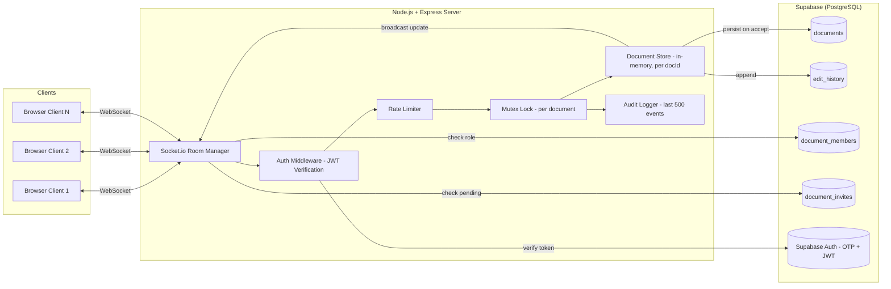
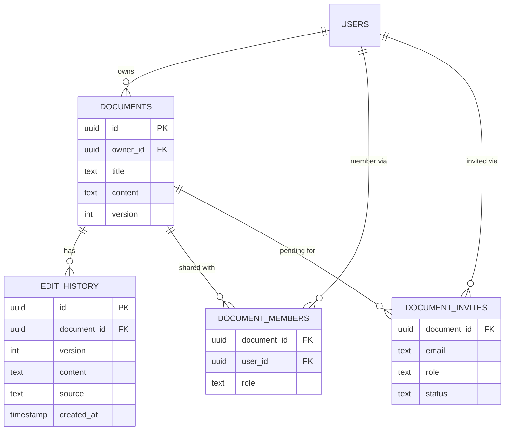
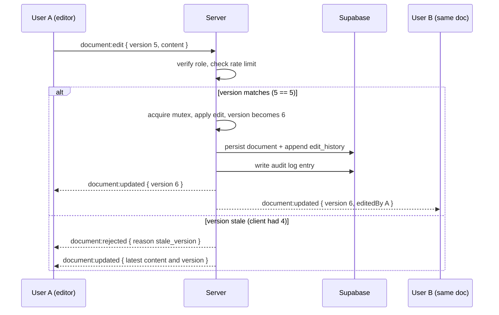
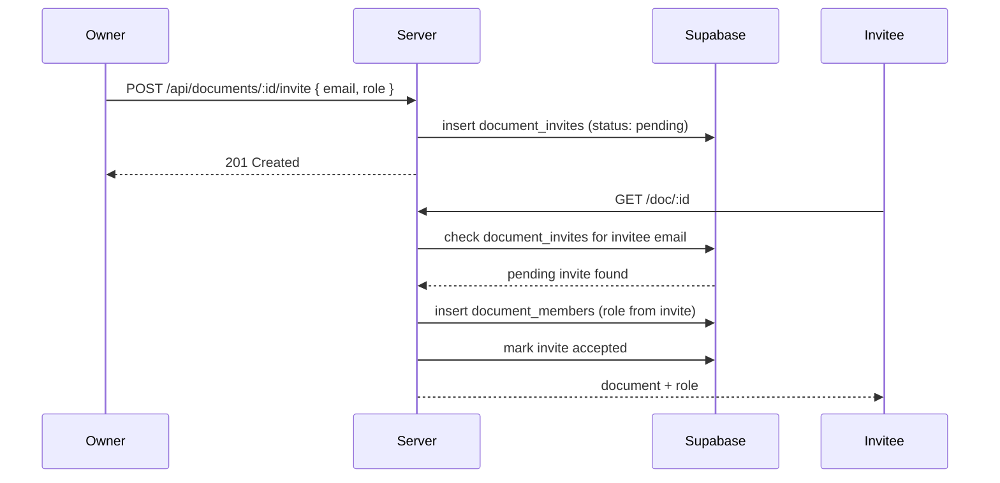
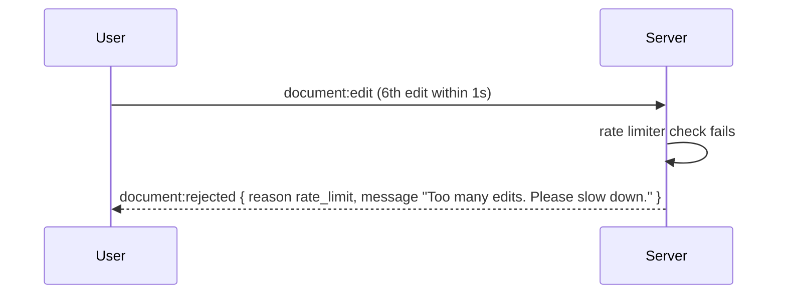

<h1 align="center">Distributed Document Collaboration System</h1>

<p align="center">
  <strong>A real-time, multi-user document editing platform with versioned concurrency control</strong><br/>
  Built with Node.js · Express · Socket.io · Supabase (PostgreSQL)
</p>

<p align="center">
  <a href="#-features">Features</a> •
  <a href="#-quick-start">Quick Start</a> •
  <a href="#-api-documentation">API</a> •
  <a href="#-sequence-diagrams">Sequence Diagrams</a> •
  <a href="#-security-considerations">Security</a> •
  <a href="#-contributing">Contributing</a>
</p>

`Node.js ≥20` · `Express 4` · `Socket.io` · `Supabase (PostgreSQL)` · `MIT License`

---

## Table of Contents

- [Project Overview](#-project-overview)
- [Motivation & Problem Statement](#-motivation--problem-statement)
- [Features](#-features)
- [System Architecture](#-system-architecture)
- [High-Level Design (HLD)](#-high-level-design-hld)
- [Low-Level Design (LLD)](#-low-level-design-lld)
- [Technology Stack](#-technology-stack)
- [Folder Structure](#-folder-structure)
- [Database Schema](#-database-schema)
- [API Documentation](#-api-documentation)
- [Socket.io Event Reference](#-socketio-event-reference)
- [Sequence Diagrams](#-sequence-diagrams)
- [Document Lifecycle](#-document-lifecycle)
- [Quick Start](#-quick-start)
- [Sample Requests](#-sample-requests)
- [Performance & Rate Limiting](#-performance--rate-limiting)
- [Security Considerations](#-security-considerations)
- [Scalability Considerations](#-scalability-considerations)
- [Design Decisions](#-design-decisions)
- [Trade-offs](#-trade-offs)
- [Future Improvements](#-future-improvements)
- [Common Errors & Troubleshooting](#-common-errors--troubleshooting)
- [Testing Guide](#-testing-guide)
- [Contributing](#-contributing)
- [License](#-license)

---

## 📌 Project Overview

**This system** is a real-time collaborative document editor — the same category of problem as Google Docs or Notion — built to demonstrate correct handling of concurrency, persistence, permissions, and recovery in a live multi-user environment.

It was developed incrementally across **ten build phases**, each adding a real production concern: authentication, ownership, roles, invites, presence, conflict resolution, audit logging, version history, rate limiting, and automatic snapshotting.

| Attribute | Detail |
|-----------|--------|
| **Project type** | Real-time collaborative document editor |
| **Primary language** | JavaScript (Node.js backend, vanilla JS frontend) |
| **Persistence** | Supabase (PostgreSQL) — source of truth |
| **Live state** | In-memory, per-document store on the server |
| **API style** | REST (`/api`) + Socket.io events |
| **Auth** | Supabase Auth — email OTP signup, JWT sessions |
| **UI** | Vanilla HTML/CSS/JS editor and dashboard |

---

## 🎯 Motivation & Problem Statement

Real-time collaborative editing sounds simple until two people edit the same paragraph at once. Naive approaches either lock the document (poor UX) or let the last write silently win (dangerous — someone's work vanishes without warning).

Teams building this kind of feature need to get several things right simultaneously:

1. **Correctness under concurrency** — edits must be ordered and conflicting edits must be detected, not merged blindly.
2. **Accountability** — every change must be traceable to a real, authenticated user.
3. **Recoverability** — mistakes and bad edits must be reversible, and data must survive a server restart.
4. **Controlled access** — not everyone who can see a document should be able to change it.

This project implements all four with a deliberately simple, inspectable stack: an in-memory document store guarded by a mutex, Supabase as the durable backing store, and Socket.io for real-time delivery — rather than reaching for a specialized CRDT or OT library, so the concurrency logic stays easy to read and reason about.

---

## ✨ Features

### Core Collaboration

| Feature | Description |
|---------|-------------|
| **Shared documents** | In-memory `{ content, version }` state per document; clients fetch and edit over Socket.io |
| **Real-time sync** | Every accepted edit is broadcast to all clients in the document's room instantly |
| **Optimistic concurrency control** | Clients submit `{ version, content }`; the server accepts only if the version matches, rejecting stale edits |
| **Mutex safety** | A per-document mutex serializes writes, eliminating race conditions under concurrent load |
| **Durable persistence** | Documents and edit history are saved to Supabase; state is reloaded on server start |
| **Undo & version restore** | Roll back to any of the last 20 saved versions; broadcast and persisted |
| **Debounced auto-save** | Client waits (default 3s) after typing stops before sending an edit, with "Saving…" / "Saved" feedback |
| **Structured logging** | Consistent logs for connects, disconnects, edits, rejections, and DB reads/writes |

### Platform & Operations

| Feature | Description |
|---------|-------------|
| **Authentication** | Email OTP signup + JWT session via Supabase Auth |
| **Ownership & multi-document support** | Each document has its own content, version, and owner |
| **Roles** | Editor / Viewer enforced server-side, not just hidden in the UI |
| **Invites** | Owners invite by email + role; auto-accepted when the invitee opens the document |
| **Presence** | Live panel of connected users per document, with join/leave toasts |
| **Conflict UX** | Clear "document refreshed" messaging instead of a silent overwrite or a dead end |
| **Audit trail** | Rolling log of the last 500 edit/undo/restore events, queryable via API |
| **Rate limiting** | Per-user edits-per-second cap with a clear rejection message |
| **Auto-snapshot** | Background timer checkpoints every open document on a fixed interval |

---

## 🏗 System Architecture



**Reading the diagram:** clients never talk to Supabase directly — every read and write passes through the Node.js server, which is the single source of truth for validation, ordering, and broadcast. Supabase exists purely as the durable backing store and identity provider; the "live" state clients actually interact with lives in the server's in-memory document store, protected by the mutex.

---

## 📐 High-Level Design (HLD)

The system follows a **thin-client, fat-server** architecture: nearly all business logic — validation, concurrency control, permissions, rate limiting — lives on the server, and the client is responsible only for rendering state and debouncing input.

| Layer | Responsibility |
|-------|----------------|
| **client/** | Editor UI, dashboard, login/signup — renders server state, sends edits, shows toasts |
| **server/index.js** | Express app bootstrap, HTTP routes, Socket.io connection and event handlers |
| **server/auth.js** | JWT verification middleware, login/signup route logic |
| **server/document.js** | In-memory document store: `{ content, version }` per `docId`, mutex-protected |
| **server/logger.js** | Structured logging for all connection, edit, and persistence events |
| **server/db/supabase.js** | Supabase client and all database read/write helpers |

**Data flow principles:**

- Supabase (PostgreSQL) is the **system of record** for documents, history, membership, and invites.
- The **in-memory store is the hot path** — every live edit is validated and applied there first, then persisted asynchronously.
- The API layer is largely **stateless** aside from the in-memory document store; scaling beyond a single instance would require moving that store to a shared cache (see [Scalability Considerations](#-scalability-considerations)).

---

## 🔬 Low-Level Design (LLD)

### Edit Path

1. Client debounces input, then emits `document:edit` with `{ docId, version, content }`.
2. Server checks the caller's role — `viewer` is rejected immediately.
3. Server checks the rate limiter — too many edits/sec is rejected with `reason: 'rate_limit'`.
4. Server acquires the per-document mutex.
5. Server compares `version` against the current in-memory version:
   - **Match** → apply the edit, increment version, release mutex.
   - **Mismatch** → reject with `reason: 'stale_version'` and return the current content/version instead.
6. On success: persist to `documents`, append a row to `edit_history`, write an audit log entry, and broadcast `document:updated` to the room.

### Presence Path

1. On socket connection, the server verifies the JWT and resolves the user's identity.
2. The user is added to the document's room and the in-memory presence set.
3. `presence:update` is broadcast to the room; a join toast fires for other members.
4. On disconnect, the reverse happens — presence set is updated and a leave toast fires.

### Invite & Access Path

1. Owner calls `POST /api/documents/:id/invite` with an email and role.
2. A row is written to `document_invites` with `status: 'pending'`.
3. When the invited user opens the document (`GET /doc/:id`), the server checks for a pending invite matching their email.
4. If found, a `document_members` row is created with the invited role, and the invite is marked accepted.

### Restore Path

1. Client emits `document:restore` with `{ docId, version }` (editor role required).
2. Server loads that version's content from `edit_history`.
3. The in-memory document is overwritten with the restored content and a **new** version number (restores are themselves new versions, not a rewind of history).
4. The restore is persisted, audited as `action: 'restore'`, and broadcast to all clients.

### Auto-Snapshot Path

1. A server-side interval timer (`AUTO_SNAPSHOT_INTERVAL_MINUTES`) fires independently of user activity.
2. For every currently open in-memory document, the current state is written to `edit_history` with `source: 'auto'`.
3. After each snapshot, `edit_history` is pruned to the most recent 20 rows per document.

---

## 🛠 Technology Stack

| Category | Technology |
|----------|------------|
| Runtime | Node.js 20+ |
| HTTP framework | Express 4 |
| Real-time transport | Socket.io (WebSockets) |
| Database | Supabase (PostgreSQL) |
| Auth | Supabase Auth (email OTP + JWT) |
| Frontend | Vanilla HTML / CSS / JavaScript |
| Email delivery | Gmail / SMTP (for OTP) |

---

## 📁 Folder Structure

```
zzz_document_collab/
├── client/
│   ├── index.html          Document editor
│   ├── dashboard.html      Document list (owned / shared / invited)
│   ├── login.html
│   └── signup.html
├── server/
│   ├── index.js             Express + Socket.io bootstrap, routes, socket handlers
│   ├── config.js            Environment configuration
│   ├── auth.js               JWT auth routes & middleware
│   ├── document.js          In-memory document store (per docId)
│   ├── logger.js            Structured logging
│   └── db/
│       └── supabase.js      Supabase client & DB helpers
├── supabase-schema-multi-doc.sql   Core schema
├── supabase-step10-migration.sql   Optional: edit_history.source column
├── start.js
├── package.json
├── .env.example
├── README.md
├── SUPABASE_SETUP.md
└── PLAN_10_STEPS.md
```

---

## 🗄 Database Schema

### Entity Overview

| Table | Purpose |
|-------|---------|
| `documents` | Document metadata: title, content, version, owner |
| `edit_history` | Append-only log of saved versions per document, capped at 20 |
| `document_members` | Maps `(user, document)` to a role (`editor` / `viewer`) |
| `document_invites` | Pending or accepted email invites per document |

### ER Diagram



**Reading the diagram:** a document has exactly one owner, but can have many members through `document_members` and many pending invites through `document_invites` — this is what powers the "My Documents / Shared with Me / Invited" split on the dashboard.

Schema files: [`supabase-schema-multi-doc.sql`](./supabase-schema-multi-doc.sql) (core) and [`supabase-step10-migration.sql`](./supabase-step10-migration.sql) (optional, adds `edit_history.source`).

---

## 📡 API Documentation

| Method | Path | Description | Access |
|--------|------|--------------|--------|
| `GET` | `/` | Redirects to `/login` | Public |
| `GET` | `/login`, `/signup` | Authentication pages | Public |
| `GET` | `/dashboard` | Lists documents — owned, shared, and invited | Authenticated |
| `GET` | `/doc/:id` | Document editor view | Authenticated |
| `GET` | `/api/documents` | Lists documents for the current user | Authenticated |
| `POST` | `/api/documents` | Creates a new document | Authenticated |
| `GET` | `/api/documents/:id` | Fetches a document plus the caller's role | Authenticated |
| `PATCH` | `/api/documents/:id` | Updates the document title | Owner only |
| `DELETE` | `/api/documents/:id` | Deletes the document | Owner only |
| `POST` | `/api/documents/:id/invite` | Invites a collaborator by email and role | Owner only |
| `GET` | `/api/audit?limit=N&documentId=uuid` | Returns recent audit log entries, optionally filtered | Authenticated |

---

## 🔌 Socket.io Event Reference

| Direction | Event | Payload | Notes |
|-----------|-------|---------|-------|
| Client → Server | `document:edit` | `{ docId, version, content }` | Debounced client-side before send |
| Client → Server | `document:restore` | `{ docId, version }` | Requires editor role |
| Client → Server | `history:get` | `{ docId }` | Fetches version history for the panel |
| Server → Client | `document:updated` | `{ docId, content, version, editedBy }` | Broadcast to the room on every accepted edit or restore |
| Server → Client | `document:rejected` | `{ reason, message, latest? }` | `reason` is `stale_version` or `rate_limit` |
| Server → Client | `presence:update` | `{ docId, users: [...] }` | Sent on join/leave |
| Server → Client | `history:list` | `{ docId, versions: [...] }` | Response to `history:get` |

---

## 🔄 Sequence Diagrams

### Edit Flow (Happy Path & Stale Version)



### Invite & Auto-Accept Flow



### Rate Limit Rejection



---

## 📬 Document Lifecycle

```
┌─────────┐    edited      ┌──────────────┐   version++    ┌────────────┐
│ Created │───────────────▶│  In-memory   │───────────────▶│  Persisted │
│         │                │   document   │                │  (Supabase)│
└─────────┘                └──────────────┘                └─────┬──────┘
                                                                  │
                    ┌─────────────────────────────────────────────┤
                    ▼                    ▼                        ▼
              ┌──────────┐        ┌────────────┐           ┌────────────┐
              │  Undone  │        │  Restored  │           │  Auto-     │
              │ (undo)   │        │ (restore)  │           │  snapshot  │
              └──────────┘        └────────────┘           └────────────┘
```

| Stage | Storage | Description |
|-------|---------|--------------|
| **Created** | `documents` | New row with `version: 1`, owner assigned |
| **Edited** | in-memory + `documents` + `edit_history` | Version incremented on every accepted edit |
| **Restored** | `edit_history` → `documents` | Historical version copied forward as a new version |
| **Auto-snapshotted** | `edit_history` (`source: 'auto'`) | Periodic checkpoint independent of user activity |
| **Pruned** | `edit_history` | Oldest rows beyond the last 20 versions are dropped |

---

## 🚀 Quick Start

### Prerequisites

| Requirement | Version |
|-------------|---------|
| Node.js | 20+ |
| Supabase project | Any tier (Auth + Postgres) |
| Gmail or SMTP account | For OTP delivery |

### 1. Clone and install

```bash
git clone <your-repo-url>
cd zzz_document_collab
npm install
```

### 2. Configure environment

```bash
cp .env.example .env
```

| Variable | Required | Description |
|---|---|---|
| `SUPABASE_URL` | Yes | Project URL — *Supabase Dashboard → Project Settings → API* |
| `SUPABASE_ANON_KEY` | Yes | Anon/public key |
| `SUPABASE_SERVICE_ROLE_KEY` | Yes | Service role key, for server-side user creation and privileged DB writes |
| `EMAIL_USER` / `EMAIL_PASSWORD` | Yes | SMTP credentials for OTP emails on signup |
| `PORT` | No | Server port (default `3000`) |
| `CORS_ORIGIN` | No | Allowed origin (default `*`) |
| `MAX_EDITS_PER_SECOND` | No | Per-user rate limit (default `5`) |
| `AUTO_SNAPSHOT_INTERVAL_MINUTES` | No | Snapshot cadence (default `5`) |

### 3. Apply the database schema

In the Supabase SQL Editor, run:

1. **`supabase-schema-multi-doc.sql`** — creates `documents`, `edit_history`, `document_members`, `document_invites`
2. *(Optional)* **`supabase-step10-migration.sql`** — adds the `source` column to `edit_history` for auto-snapshot support

Full walkthrough: [`SUPABASE_SETUP.md`](./SUPABASE_SETUP.md)

### 4. Run

```bash
npm start
```

The app is now available at **http://localhost:3000** (or your configured `PORT`).

---

## 🧪 Sample Requests

### Create a document

```bash
curl -X POST http://localhost:3000/api/documents \
  -H 'Authorization: Bearer <jwt>' \
  -H 'Content-Type: application/json' \
  -d '{ "title": "Q3 Planning Notes" }'
```

### Invite a collaborator

```bash
curl -X POST http://localhost:3000/api/documents/<docId>/invite \
  -H 'Authorization: Bearer <jwt>' \
  -H 'Content-Type: application/json' \
  -d '{ "email": "teammate@example.com", "role": "editor" }'
```

### Rename a document

```bash
curl -X PATCH http://localhost:3000/api/documents/<docId> \
  -H 'Authorization: Bearer <jwt>' \
  -H 'Content-Type: application/json' \
  -d '{ "title": "Q3 Planning Notes (Final)" }'
```

### Fetch audit log for a document

```bash
curl -s 'http://localhost:3000/api/audit?documentId=<docId>&limit=50' \
  -H 'Authorization: Bearer <jwt>'
```

### Submit an edit over Socket.io (client-side)

```javascript
socket.emit('document:edit', {
  docId: '<docId>',
  version: 6,
  content: 'Updated document body...'
});

socket.on('document:updated', ({ content, version, editedBy }) => {
  // Render the new content and version
});

socket.on('document:rejected', ({ reason, message }) => {
  // "stale_version" -> refresh from latest; "rate_limit" -> show toast
});
```

---

## ⚡ Performance & Rate Limiting

The system favors **correctness and clarity over raw throughput** — the mutex serializes writes per document, and every accepted edit does a synchronous round trip to Supabase before broadcasting. This is intentional: for a collaborative editor, losing an edit is far more costly than a few extra milliseconds of latency.

Key knobs:

- **`MAX_EDITS_PER_SECOND`** — caps how fast a single user can submit edits, protecting the server and Supabase from being overwhelmed by a runaway client.
- **Client-side debounce** — reduces the number of edits sent in the first place, so most users never approach the rate limit under normal typing.
- **Mutex granularity is per-document**, not global — edits to different documents never block each other.

There is no bundled load-testing script in this project; if you need throughput numbers for your deployment, benchmark against your own Supabase instance and network conditions rather than relying on numbers from a different environment.

---

## 🔒 Security Considerations

| Area | Current State | Production Recommendation |
|------|----------------|----------------------------|
| **Authentication** | Supabase Auth, OTP + JWT | Rotate JWT signing keys per Supabase's recommended schedule |
| **Authorization** | Role checks (`owner`/`editor`/`viewer`) enforced server-side | Keep all permission checks server-side; never trust client-sent roles |
| **Transport** | HTTP/WebSocket | Terminate TLS in front of the app (reverse proxy or platform-level HTTPS) |
| **Secrets** | `.env` file | Use a secrets manager in production; never commit `.env` |
| **Service role key** | Used server-side only | Never expose `SUPABASE_SERVICE_ROLE_KEY` to the client bundle |
| **CORS** | Configurable origin | Restrict `CORS_ORIGIN` to your actual frontend domain in production |
| **Rate limiting** | Per-user edit throttle | Consider adding request-level rate limiting on the REST API too |

---

## 📈 Scalability Considerations

| Dimension | Strategy |
|-----------|----------|
| **Single-instance state** | The document store is in-memory and per-process; running multiple server instances requires moving this state to a shared store (e.g., Redis) or using Socket.io's Redis adapter for cross-instance broadcast |
| **Database load** | Every accepted edit writes to Supabase; under heavy edit volume, consider batching writes or widening the debounce window |
| **History growth** | Already bounded — `edit_history` is pruned to the last 20 versions per document |
| **Presence at scale** | Presence is tracked in memory per instance; a multi-instance deployment needs a shared presence store |
| **Read-heavy endpoints** | `/api/audit` and dashboard listings could be moved to a read replica if Supabase usage grows |

The current design deliberately trades horizontal scalability for simplicity — it is well suited to a single-instance deployment or as a foundation to extend, not a drop-in multi-region system.

---

## 🧠 Design Decisions

| Decision | Rationale |
|----------|-----------|
| **In-memory document store, not DB-per-edit reads** | Keeps the hot path (live edits) fast; Supabase is written to but not read from on every keystroke |
| **Optimistic concurrency (version numbers) over locking** | Lets multiple users type freely; only actual conflicts are rejected, not every simultaneous connection |
| **Mutex per document, not global** | Prevents unrelated documents from blocking each other under load |
| **Reject-and-refresh instead of auto-merge** | Text merging is ambiguous and risky to get silently wrong; refreshing the client and letting the human re-apply their change is safer |
| **Debounced client saves** | Reduces server and network load without meaningfully hurting perceived responsiveness |
| **Auto-snapshot independent of edits** | Guarantees recovery points even for documents nobody explicitly "saved" recently |
| **Server-side role enforcement** | UI-only restrictions can be bypassed; permissions must be checked where the write actually happens |

---

## ⚖️ Trade-offs

| Choice | Benefit | Cost |
|--------|---------|------|
| In-memory store vs. always reading from DB | Fast live edits | State is lost on crash unless persisted quickly; single point of truth per process |
| Reject-on-conflict vs. operational transforms/CRDTs | Simple, predictable, easy to audit | Users occasionally have to re-apply a change instead of it auto-merging |
| Per-document mutex vs. lock-free structures | Easy to reason about correctness | Serializes all edits to one document, even from different users |
| Vanilla JS frontend vs. a framework | No build step, easy to read | More manual DOM management as the UI grows |
| 20-version history cap | Bounded storage growth | Very old versions are not recoverable |

---

## 🔮 Future Improvements

- [ ] Move the in-memory document store to a shared cache (e.g., Redis) for multi-instance deployment
- [ ] Socket.io Redis adapter for cross-instance presence and broadcast
- [ ] Field-level or operational-transform-based merging instead of whole-document reject-and-refresh
- [ ] Configurable history retention (beyond the fixed 20-version cap)
- [ ] Per-endpoint REST rate limiting, not just Socket.io edit throttling
- [ ] Automated integration test suite covering concurrency edge cases
- [ ] Read replica routing for `/api/audit` and dashboard queries at scale

---

## 🐛 Common Errors & Troubleshooting

| Error / Symptom | Likely Cause | Fix |
|------------------|---------------|-----|
| Edits rejected immediately on every attempt | Wrong or expired JWT in socket handshake | Re-authenticate; confirm the token is passed in the handshake |
| "Your edit was based on an old version" repeatedly | Another user is editing concurrently, or client didn't refresh after a prior rejection | Confirm the client applies `document:updated` payloads before allowing further edits |
| "Too many edits. Please slow down." | Client is sending edits faster than `MAX_EDITS_PER_SECOND` | Increase the debounce window or raise the limit if appropriate |
| Signup OTP email never arrives | `EMAIL_USER` / `EMAIL_PASSWORD` misconfigured, or provider blocking SMTP | Verify SMTP credentials and check spam folder; test with a known-working provider |
| Viewer sees an editable textarea | Role not being enforced or fetched correctly on the client | Confirm `/api/documents/:id` returns the correct role and the UI respects it |
| Document empty after server restart | Server started before Supabase finished loading, or schema not applied | Confirm `supabase-schema-multi-doc.sql` has been run and Supabase credentials are correct |
| Invite never becomes membership | Invitee's email doesn't match the invited email exactly, or they haven't opened the document | Confirm exact email match; accepting happens on `GET /doc/:id`, not on invite creation |

**Debug checklist:**

```bash
# Confirm the server is running and reachable
curl -s http://localhost:3000/

# Confirm environment variables are loaded
node -e "require('dotenv').config(); console.log(!!process.env.SUPABASE_URL)"

# Check server logs for connect/edit/reject events
npm start
```

---

## ✅ Testing Guide

### Manual Smoke Test

1. Sign up two test accounts and verify OTP for each.
2. Create a document with account A; invite account B as an editor.
3. Open the document in two browser windows (A and B) and confirm presence shows both users.
4. Edit simultaneously in both windows and confirm one edit succeeds while the other is offered a refresh, not silently dropped.
5. Restore an earlier version and confirm it broadcasts to both windows.
6. Check `GET /api/audit?documentId=<docId>` reflects the edits, undo, and restore.

### Rate Limit Test

Send more than `MAX_EDITS_PER_SECOND` edits in under a second from one client and confirm the excess are rejected with `reason: 'rate_limit'` rather than crashing the server.

### Planned Automated Tests

An automated test suite covering concurrency edge cases (simultaneous stale edits, rapid reconnect/disconnect, rate-limit boundaries) is listed under [Future Improvements](#-future-improvements).

---

## 🤝 Contributing

Contributions are welcome. When proposing a change:

- Keep permission and concurrency checks server-side.
- Add or update the relevant section of this README if behavior changes.
- If you touch the schema, include the corresponding SQL migration alongside your change.

---

## 📄 License

Released under the **MIT License** — see [`package.json`](./package.json) for details.
